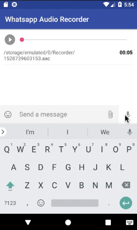

# WhatsappAudioRecorder
Simple audio recorder using Android's AudioRecorder with `.aac` File extention.

### Using AudioRecorder class
Sometimes Android's [MediaRecorder][1] class does not releases the AudioFocus because of which Mic stops recording audio on next attempt and user does not get any clue why audio is not recording. Using [AudioRecord][2] class we get raw 
PCM data and we can compare the expected recorded bytes and recorded audio bytes comparing which we can confirm the issue with gaining mic control and update user accordingly. If this case occurs in example app I have stopped the timer increment so that user would understand that there is some problem while recording an audio. 

[1]: https://developer.android.com/reference/android/media/MediaRecorder
[2]: https://developer.android.com/reference/android/media/AudioRecord
[3]: https://github.com/3llomi/RecordView

## Preview

  

#### Libraries used
* AppCompat
* [RecordView][3]
